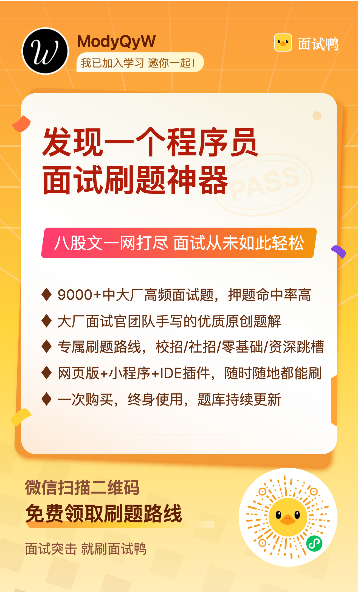
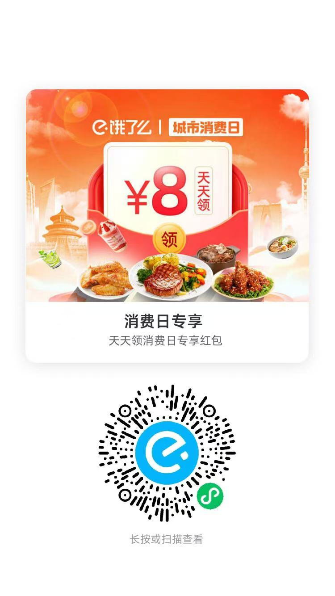
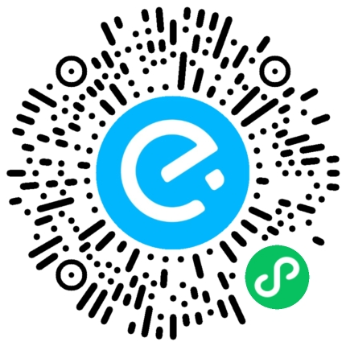

# Sponsors

你好 👋

我是 ModyQyW，一个开源爱好者，一个前端开发工程师，一个半吊子全栈工程师，希望能做自己力所能及的事帮助到其他人。我关注开发者体验，为此我在业余时间创建/参与了一些开源项目。你可以在 GitHub 上查看我的工作 <https://github.com/ModyQyW>。

你的赞助对我来说意义重大，它将帮助我积极维持我的项目，激励我创造出更多有趣、有价值的事物，使我的更多想法得以实现，同时我也会重新分配赞助给 uni-helper 团队成员。请留下你的称呼和备注，这样我就可以把你加入到赞助者名单中了。非常感谢！🙏

Hello 👋

I'm ModyQyW, an open source enthusiast, a front-end development engineer, and a half-decent full-stack engineer looking to do what I can to help others. I care about the developer experience, and to that end I've created / joined some open-source projects. You can check out my work on GitHub at <https://github.com/ModyQyW>.

Your sponsorship means a lot to me, it will help me to actively maintain my project, motivate me to create more interesting and valuable things and make more of my ideas come to life. Also, I will redistribute your sponsorship to uni-helper team members. Please leave your designation and notes so I can add you to the list of sponsors. Thank you very much! 🙏

<table>
  <tr style="visibility: collapse;">
    <th></th>
    <th></th>
    <th></th>
    <th></th>
    <th></th>
    <th></th>
    <th></th>
    <th></th>
  </tr>
  <tr>
    <th colspan="8">
      <h4>😄 直接赞助 Sponsor Directly</h4>
    </th>
  </tr>
  <tr>
    <th colspan="4">
      

        
        支付宝 alipay
      

      
预约转账请填写账号 wurui-dev@foxmail.com

      
      
    </th>
    <th colspan="4">
      

        
        微信 wechat
      

      
    </th>
  </tr>
  <tr>
    <th colspan="4">
      <a href="https://afdian.com/a/ModyQyW" target="_blank">
        

          
          爱发电 afdian
        

      </a>
    </th>
  </tr>
  <tr><td colspan="8"></td></tr>
  <tr>
    <th colspan="8">
      <h4>😄 间接赞助 Sponsor Indirectly</h4>
    </th>
  </tr>
  <tr>
    <th colspan="8">
      

        <a href="https://cloud.siliconflow.cn/i/MRRM9oS3" target="_blank">
          
          硅基流动 SiliconFlow
        </a>
      

      
加速 AGI 普惠人类

    </th>
  </tr>
  <tr>
    <th colspan="8">
      

        <a href="https://open.cherryin.ai/register?aff=GJ8D" target="_blank">
          
          CherryIN
        </a>
      

      
统一的大模型接口网关

    </th>
  </tr>
  <tr>
    <th colspan="8">
      

        <a href="https://zeabur.com/referral?referralCode=ModyQyW" target="_blank">
          
          Zeabur
        </a>
      

      
轻松部署，无限扩展

    </th>
  </tr>
  <tr>
    <th colspan="8">
      

        <a href="https://www.bigmodel.cn/glm-coding?ic=WZQSPKGA2S" target="_blank">
          
          智谱
        </a>
        |
        <a href="https://z.ai/subscribe?ic=SNRRNING7K" target="_blank">
          
          z.ai
        </a>
      

      
一站式大模型开发平台

    </th>
  </tr>
  <tr>
    <th colspan="8">
      

        <a href="https://www.mianshiya.com/vip?shareCode=yzb9ja" target="_blank">
          
          程序员刷题神器面试鸭
        </a>
      

      
高效准备面试，9000+ 高频面试真题、800 万字优质题解，覆盖主流编程方向，跟我一起刷原题、过面试

      
    </th>
  </tr>
  <tr>
    <th colspan="4">
      
美团外卖红包 meituan

      
    </th>
    <th colspan="4">
      
饿了么红包 eleme

      
      
    </th>
  </tr>
</table>

  

